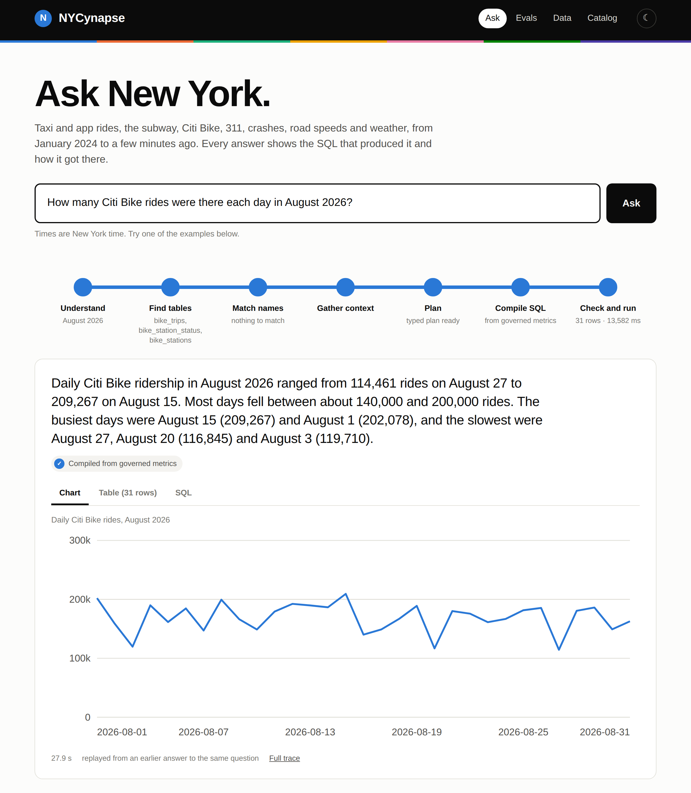
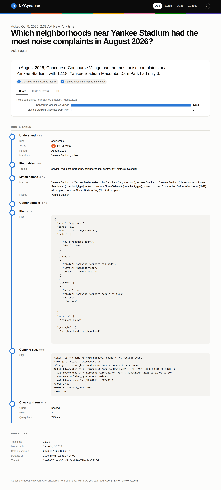

# NYCynapse.Ai

Ask questions about New York City in plain English and get answers from city data, with the SQL and every step behind them. The data comes from [NYCynapse Lake](https://github.com/giridhar1103/NYCynapse_Lake): taxi and app rides, the subway, Citi Bike, 311, crashes, road speeds and weather, from January 2024 to the last few minutes.

**Live:** [giriworks.com/nycynapse](https://giriworks.com/nycynapse/)

<picture>
  <source media="(prefers-color-scheme: dark)" srcset="docs/img/ask-dark.png">
  
</picture>

The design follows the path Uber described for [QueryGPT](https://www.uber.com/blog/query-gpt/) and the semantic layers that came after it. A question is never answered by handing a model the whole schema. It is narrowed step by step: which domain, which tables, which values, which joins, and only then SQL, checked before and after it runs.

## How a question is answered

The pipeline is a [LangGraph](https://github.com/langchain-ai/langgraph) state graph. Each stage is a node, and every stage's output is streamed to the page and kept in a trace.

1. **Understand.** Classify the question (answerable, needs clarifying, outside the data, not a data question), pick the domains, and resolve the time window in New York time. "Last weekend" becomes two exact dates before any model sees a table.
2. **Find tables.** Hybrid retrieval over the catalog: vector search and full text search over names and descriptions, limited to the chosen domains.
3. **Match names.** Words in the question are matched to real values in the data with trigram search, so "loud parties" becomes `Loud Music/Party` and "the A" becomes route `A`. Named places resolve to fixed sets of neighborhoods, taxi zones and stations.
4. **Gather context.** Only the chosen models, their metrics and the joins between them, plus domain rules and reviewed examples of similar questions.
5. **Plan.** The model fills in a typed query plan (model, metrics, filters, groupings, places) instead of writing SQL. If the data cannot answer the question, it says so here and the pipeline declines with its reason.
6. **Compile SQL.** Code turns the plan into SQL: governed metric definitions, declared join paths, time filters that use the right column and time zone, and list columns unnested correctly. A model never invents a join.
7. **Check and run.** A guard parses the SQL and allows a single `SELECT` on gold tables only. The data's coverage is checked against the window, so a question about a month the data does not hold is declined instead of answered with zero. The query runs read-only; results are checked against each metric's plausible bounds.
8. **Repair.** An error, an empty result or an out of bounds value goes back to the planner with the reason, at most twice.
9. **Answer.** A short answer is written from the result, and every number in it is checked against the result table. Numbers that cannot be traced are flagged on the page.

<picture>
  <source media="(prefers-color-scheme: dark)" srcset="docs/img/trace-dark.png">
  
</picture>

## Results

<!-- results:start -->
Results are being produced.
<!-- results:end -->

## Evaluation

The evaluation set was written before the pipeline and has 175 questions with reference SQL, across one table and joins, dates and periods, names and places, live feeds, and questions that should be declined: future dates, data the city does not publish, unsafe requests and questions that need clarifying.

* **Splits.** 95 development questions used while building, 25 regression questions from earlier mistakes, and 55 holdout questions kept outside the repository and never used while building. Paraphrases of the same question always land in the same split.
* **Frozen data.** Every run reads the lake at one pinned DuckLake snapshot, so live tables do not move the answers between runs.
* **Correct means the rows match.** The result is compared with the reference query's result as a multiset, with a tolerance for numbers and extra columns allowed. SQL that looks similar but returns different rows is wrong; different SQL that returns the same rows is right.
* **Five builds**, each adding one piece, run on the same questions:

| Build | What it adds |
|---|---|
| E0 | The full schema in the prompt, SQL written directly. The usual starting point. |
| E1 | Routing to a domain and only the tables that matter |
| E2 | Name matching, exact time windows, place resolution and the coverage check |
| E3 | Typed plans compiled to SQL from governed metrics and declared joins |
| E4 | Reviewed question and plan pairs, found by similarity, as examples |

Each run records the catalog version, prompt versions, model, latency, tokens and cost per question. `nycynapse eval-publish` copies only the summary of a run to `evals/results/`, so holdout questions never reach the repository or the site.

## Semantic layer

Everything the system may know about the lake is declared in [`semantic/`](semantic):

| File | What it holds |
|---|---|
| `workspaces.yaml` | Ten domains (taxis and app rides, subway, Citi Bike, 311, traffic safety, road speeds, weather, data freshness, places, calendar) and the models in each |
| `models/` | 27 semantic models over the gold tables: time columns, keys, dimensions, measures and named filters |
| `metrics/` | 39 governed metrics with units, bounds and how they may be added up |
| `relationships.yaml` | 46 joins the planner is allowed to use |
| `time.yaml` | Named parts of the day and week, such as rush hour |
| `places.yaml` | Landmarks, venues, airports and stations people name, such as Yankee Stadium |
| `instructions.yaml` | Domain rules, such as how subway delay is signed or why taxi tips need card trips |
| `verified/queries.yaml` | Reviewed question and plan pairs used as examples |

A few choices worth calling out:

* **Metrics carry their additivity.** Precipitation adds up over hours but not across boroughs, so a citywide figure averages the boroughs instead of summing five weather stations. The compiler enforces this instead of trusting generated SQL to remember it.
* **Metrics can have several sources.** Trip counts come from the hourly zone aggregate when the question allows it, and fall back to the 650 million row trip table only when it needs something the aggregate does not carry.
* **Joins are declared, not invented.** Relationships include plain key joins, time joins (a crash to the weather in its borough that hour) and range joins (a subway arrival during a weather alert). Range joins can match more than one row, so they are applied as `EXISTS` filters and never inflate counts.
* **Places resolve before SQL is written.** "Near Yankee Stadium" becomes a fixed set of neighborhoods, taxi zones, subway stations and bike stations, worked out from the lake's boundaries when the catalog is built.

`semantic/gold_manifest.json` is a snapshot of the gold tables and their dbt documentation. `nycynapse check` parses every SQL fragment in the semantic layer with sqlglot and checks every column it names against that snapshot, so a renamed column in the lake fails CI here.

## Catalog

`nycynapse publish` validates the semantic layer and writes it to Postgres as a new catalog version:

* 372 objects (models, dimensions, metrics, relationships, places and so on), each with a short description, a 384-dimension embedding (`bge-small-en-v1.5`, run locally) and a full text index
* 16 thousand distinct values of the dimensions that need grounding, such as complaint types, station names and neighborhood names, indexed with trigrams
* the coverage of every named place

A version only becomes current once all of it is written. Older versions are kept because traces and evaluation runs record the version they used.

## Generated SQL cannot write

Generated SQL runs on a DuckDB connection with DuckLake attached read-only, network access and extension loading off, file access limited to the lake's data directory, and configuration locked. File access cannot be switched off completely, because DuckLake reads its own Parquet files, and DuckDB still allows `COPY ... TO` inside an allowed directory. So there are three more layers:

* a SQL guard that only lets a single `SELECT` on gold tables through, with a list of blocked functions
* the API service sees the lake directory mounted read-only by systemd
* its Postgres role can read the lake catalog and nothing else

## The site and API

A FastAPI service streams each answer as server-sent events, one per stage, and stores a trace of every question in Postgres. The pages are plain HTML, CSS and JavaScript with no build step, styled after transit signage: a black sign band, route bullets for each domain and the pipeline drawn as a line of stations. Each reader gets a few questions an hour, the site has a daily spending cap, questions run one at a time, and a question asked recently is replayed from its trace without calling a model.

| Page | Shows |
|---|---|
| `/` | Ask, with the stages lighting up as they finish, then the answer, chart, table and SQL |
| `/trace?id=` | The route one answer took, with the plan, SQL, timings and cost |
| `/evals` | The results above, by split and by question type |
| `/data` | How fresh every lake table is and recent gaps in live feeds |
| `/catalog` | The domains, models and governed metrics |

The model provider is pluggable and set in a providers file, by role: one for routing, one for planning, one for writing answers.

## MCP server

The same pipeline is available to any MCP client over stdio, with four read-only tools:

| Tool | Does |
|---|---|
| `ask` | Runs the full pipeline and returns the answer, SQL, rows and checks, and keeps a trace |
| `domains` | Lists the domains, their models and example questions |
| `metric` | Shows how a governed metric is defined and where it comes from |
| `run_sql` | Runs one `SELECT` on gold tables through the same guard and read-only connection |

```json
{
  "mcpServers": {
    "nycynapse": {
      "command": "/path/to/NYCynapse/.venv/bin/nycynapse-mcp",
      "env": { "NYC_LAKE_PG_DSN": "...", "NYC_APP_PG_DSN": "..." }
    }
  }
}
```

## Running it

```bash
python3.12 -m venv .venv
.venv/bin/pip install -e ".[dev,mcp]"
set -a; . /path/to/env; set +a        # NYC_LAKE_PG_DSN, NYC_APP_PG_DSN

.venv/bin/nycynapse export-gold      # refresh the gold snapshot from the lake
.venv/bin/nycynapse check            # validate the semantic layer
.venv/bin/nycynapse publish          # write a new catalog version
.venv/bin/pytest -q

.venv/bin/nycynapse eval-pin                           # freeze a lake snapshot for evaluation
.venv/bin/nycynapse eval --system e4 --split dev       # run a build over a split
.venv/bin/nycynapse eval-publish evals/runs/<run>.json # publish its summary

.venv/bin/uvicorn nycynapse.api.app:app --port 8031    # the site and API
```

`deploy/` has the systemd unit and the nginx configuration used in production.
